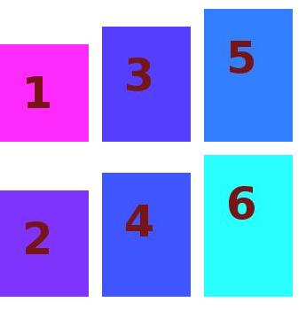

###pyliterature
A Python module for image processing: merge, crop.


###Author
* Xing Wang  <xingwang1991@gmail.com>


###Dependencies

* Python >=27
* PIL


####Examples

```python
>>> from pyimage import Merge
>>> pyim = Merge(dir = '.')
>>> pyim.scanImages()
>>> arrage = [['1.jpg', '3.jpg', '5.jpg'], 
...           ['2.jpg', '4.jpg', '6.jpg']]
>>> interval = [15, 15]
>>> pyim.mergeImages(arrage, interval)
>>> pyim.saveImages()
```


merge images above 6 images to one image. The positions of each image is determined by the arrange list.

[['1.jpg', '3.jpg', '5.jpg'], 
 ['2.jpg', '4.jpg', '6.jpg']]




If you want to add features/improvement or report issues, feel free to send a pull request!


###TODO
* add label
