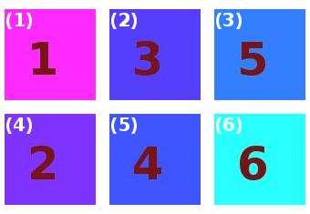

### pyliterature
A Python module for image processing: merge, crop.


### Author
* Xing Wang  <xingwang1991@gmail.com>


### Dependencies

* Python >=27
* PIL


### Examples

#### Merge
```python
>>> from pyimage import Merge
>>> pyim = Merge(dir = '.')
>>> pyim.scanImages()
>>> arrage = [['1.jpg', '3.jpg', '5.jpg'], 
...           ['2.jpg', '4.jpg', '6.jpg']]
>>> interval = [15, 15]
>>> pyim.mergeImages(arrage, interval)
>>> pyim.saveImages()
```


merge above 6 images to one image and add labels. The positions of each image is determined by the arrange list.

[['1.jpg', '3.jpg', '5.jpg'], 

 ['2.jpg', '4.jpg', '6.jpg']]



#### Crop
```python
>>> from pyimage import Crop
>>> pyim = Crop('.')
>>> images = ['1.jpg']
>>> edge = [50, 50, 50, 50]
>>> pyim.cropImages(images, edge, 'w')
>>> pyim.saveImages()
```


crop a minimum box of the non-black or non-white regions in the above image. 

[['1.jpg', '3.jpg', '5.jpg'], 

 ['2.jpg', '4.jpg', '6.jpg']]


If you want to add features/improvement or report issues, feel free to send a pull request!


### TODO
* add label
